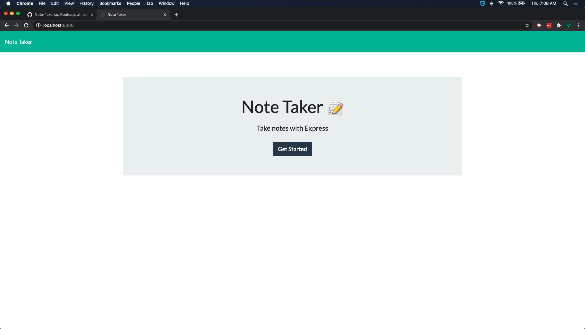

# note-taker

## description

Express application to manage notes (add, delete and edit)

## Application Screenshot

## Deployed Application

[NOTE TAKER](https://shielded-coast-90680.herokuapp.com/)

## Installation

Copy repo contents to localhost or application hosting platform (like Heroku). If running locally install node dependencies then run server.js from command line.

## Technologies

Express, NodeJS, JQuery, BootStrap

## Credits

NodeJS Developers
Bootstrap Developers
Express Developers
Jquery Developers

## License

Licensed under the [MIT](LICENSE) license
